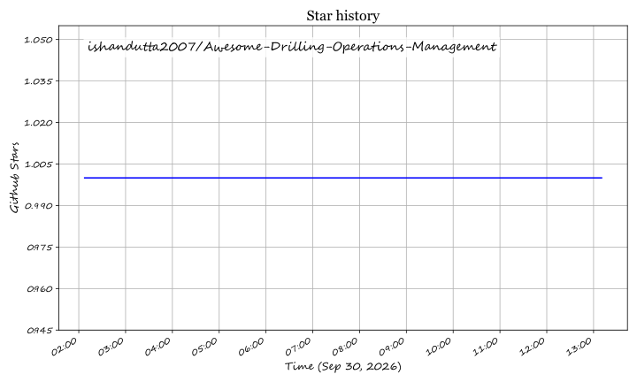

# ⚙️ Awesome Drilling Operations Management   

> **🚀 Curated list of SaaS products, cloud platforms, and open-source projects for Drilling Operations Management, Well Trajectory Planning, WITSML Data Integration, and Real-Time Drilling Analytics.**

*Focused on Well Planning, Real-Time Rig Monitoring & Drilling Performance Optimization.*

---

## 📋 Table of Contents

- [📊 Overview & Industry Market Analysis](#-overview--industry-market-analysis)
- [🏢 SaaS & Enterprise Platforms](#-saas--enterprise-platforms)
- [💻 Open-Source GitHub Projects](#-open-source-github-projects)
- [📡 Key Standards & Protocols](#-key-standards--protocols)
- [🤝 How to Contribute](#-how-to-contribute)
- [💖 Support & Sponsorship](#-support--sponsorship)
- [📈 Star History](#-star-history)
- [⚠️ Disclaimer](#%EF%B8%8F-disclaimer)

---

## 📊 Overview & Industry Market Analysis

The global **Drilling Operations Management & Well Engineering Software sector** is estimated at **$3.2 Billion (2025/2026)** and is projected to reach **$5.4 Billion by 2030** (CAGR ~8.5%). 

### 🏗️ Sector Structure & Market Dynamics
The market is **moderately concentrated** at the enterprise core—dominated by major oilfield service providers (SLB, Halliburton, Baker Hughes, Weatherford) and legacy software suites (Peloton)—while experiencing **increasing fragmentation in cloud analytics, AI optimization, and open-source data tooling** driven by innovative entrants like Corva and self-hosted open-source packages.

---

## 🏢 SaaS & Enterprise Platforms

Below is a comparison of top enterprise Drilling Operations Management platforms, sorted by **company market scale / revenue / valuation (descending)**.

| Platform | Starting Pricing | Free Tier / Trial Limit | Scale / Valuation / Revenue | Description |
| :--- | :--- | :--- | :--- | :--- |
| **[SLB DrillPlan](https://www.slb.com/)** | Custom enterprise quote (contact sales) | Demo available upon enterprise request (No free self-serve plan) | **~$36.5B Annual Revenue** (Market Cap ~$65B) | Enterprise-grade cloud well planning & engineering environment (DELFI) covering trajectory design, casing, hydraulics, and wellbore stability. |
| **[Halliburton DecisionSpace](https://www.halliburton.com/)** | Custom enterprise quote (contact sales) | Demo upon corporate request (No free trial) | **~$23.0B Annual Revenue** (Market Cap ~$28B) | Integrated E&P exploration & operations software suite providing real-time drilling control, well planning, and operational monitoring. |
| **[Baker Hughes JewelSuite / WellSite](https://www.bakerhughes.com/)** | Custom enterprise quote (contact sales) | Enterprise demonstration on request (No free self-serve plan) | **~$26.0B Annual Revenue** (Market Cap ~$35B) | Integrated subsurface and drilling engineering solution for reservoir modeling, directional well design, and real-time monitoring. |
| **[NOV WellData](https://www.nov.com/)** | Custom enterprise quote (contact sales) | Demo available on request (No free self-serve plan) | **~$8.9B Annual Revenue** (Market Cap ~$7.5B) | Real-time rig data aggregation, WITSML server integration, EDR visualization, and operational monitoring dashboards. |
| **[Weatherford Centro](https://www.weatherford.com/)** | Custom enterprise quote (contact sales) | Demo available on request (No free trial) | **~$5.4B Annual Revenue** (Market Cap ~$6.5B) | Advanced real-time drilling optimization software with automated drilling controls, NPT reduction, and continuous performance analytics. |
| **[Pason](https://www.pason.com/)** | Custom daily rig rate quote | Operational demo on request (No free trial) | **~$380M Annual Revenue** (Market Cap ~$1.2B) | Leading rig instrumentation and electronic drilling recorder (EDR) platform providing real-time data streaming and field reporting. |
| **[Seeq](https://www.seeq.com/)** | Enterprise cloud quote (Est. starting $12,000+/yr) | Demo on request (No free self-serve trial) | **~$50M - $100M ARR** (Private; Total Funding ~$115M) | Advanced time-series process analytics and operational intelligence platform used for real-time NPT detection and ROP analysis. |
| **[Peloton WellView](https://www.peloton.com/)** | Custom annual site/user enterprise license | Private corporate demo (No free self-serve trial) | **~$50M - $100M Revenue** (Private enterprise software vendor) | Industry-standard well data management and daily drilling reporting software covering full well lifecycle from spud to abandonment. |
| **[Corva](https://www.corva.ai/)** | Custom quote / AWS Private Offer | Live guided demo available (No public free trial) | **Valuation ~$500M+** (Est. Revenue $50M+; Series B/Growth) | Cloud-native, AI-powered drilling and completions real-time analytics platform with custom app ecosystem and automated NPT tracking. |
| **[WellDatabase](https://www.welldatabase.com/)** | **$300 / month** (Essential tier) | **Lite Tier: Free Forever** (Public well data & mapping); **3-Day Free Trial** for paid plans | **~$10M - $20M Revenue** (Private SaaS vendor) | Modern cloud well data management and production analytics platform with daily reporting, NPT tracking, and REST API access. |
| **[RigER](https://www.riger.com/)** | **$149 / user / month** (Estimated starting) | Personalized interactive demo on request (No permanent free plan) | **~$5M - $15M Revenue** (Private oilfield software vendor) | Drilling rig equipment management, job scheduling, field reporting, and operational invoicing software tailored for oilfield service companies. |

---

## 💻 Open-Source GitHub Projects

Curated open-source libraries, web applications, and analytics servers for petroleum engineers and software developers, **sorted by GitHub Stars_Count (descending)**.

| Project | GitHub_Stars | Primary Language / Stack | Key Features & Focus Area |
| :--- | :--- | :--- | :--- |
| **[welleng](https://github.com/jonnymaserati/welleng)** |  | Python | Comprehensive well trajectory engineering library featuring survey management, ISCWSA well paths, Mahalanobis collision detection, kick-tolerance engine, and tortuosity calculations. |
| **[well_profile](https://github.com/pro-well-plan/well_profile)** |  | Python | Trajectory planning tool for quick directional survey calculations, 3D trajectory plotting, and integration with torque/drag (`torque_drag`) and thermal models (`pwptemp`). |
| **[Witsml Explorer](https://github.com/equinor/witsml-explorer)** |  | TypeScript / C# | Open-source WITSML server data browser and management application built by Equinor. Supports WITSML 1.4.1.1 logs, curves, trajectories, geology intervals, and QA/QC jobs. |
| **[witskit](https://github.com/Critlist/witskit)** |  | Python / Pydantic | High-performance Python SDK for decoding and parsing Wellsite Information Transfer Standard (WITS) raw data frames with SQLite/PostgreSQL time-series storage. |
| **[directional_drilling](https://github.com/faridrafati/directional_drilling)** |  | TypeScript / React / Three.js | Full-stack web application for directional drilling calculations and 3D wellbore trajectory visualization with Petrel `.grd` grid file parsing and PDF/XLSX export. |
| **[drilling_mcp_server](https://github.com/ridhadev/drilling_mcp_server)** |  | Python / FastMCP | Model Context Protocol (MCP) server bringing AI assistant integration (Claude/GPT) to drilling data analysis for computing ROP, MSE, and NPT from sensor logs. |
| **[Oil Field Integrated Dashboard](https://github.com/sattar-almohsin/Oil-Field---Integrated-Reservoir-Operations-Dashboard)** |  | Streamlit / Python | Operations and reservoir surveillance web application built on Equinor's Volve field dataset featuring well operational KPIs, decline curve analysis, and intervention scoring. |
| **[Drill AI Platform](https://github.com/ahmadaijaz1030/Drill-AI-Platform)** |  | React / Node.js / AWS | AI intelligence dashboard for automated processing of drilling logs, rock composition analytics, and conversational natural language queries for drilling engineers. |
| **[Drilling Management Studio](https://github.com/gewazy/DrillingManagementStudio)** |  | C# / .NET | Desktop database and team workflow management application designed for organizing drilling crews and seismic project operations. |
| **[OpenGeoPlotter](https://github.com/OpenGeoPlotter/OpenGeoPlotter)** |  | Python / PyQt5 | Desktop visualization application for geological drill hole data, supporting strip logs, downhole cross-sections, and 3D geological modeling. |
| **[welltrajconvert](https://github.com/petro-tools/welltrajconvert)** |  | Python | Python utility library for converting directional survey parameters (MD, Inclination, Azimuth) to 3D Cartesian coordinates (TVD, N/S, E/W). |
| **[WellTrajectoryCalculator](https://github.com/drillingmanual/WellTrajectoryCalculator)** |  | C++ | High-performance C++ engine for directional survey calculations utilizing minimum curvature method standard equations. |

---

## 📡 Key Standards & Protocols

When building or deploying software in drilling operations, compliance with industry standards is critical:
- ⚡ **WITS (Wellsite Information Transfer Standard)**: Legacy binary/ASCII record-based streaming protocol for rigsite data acquisition.
- 📜 **WITSML (Wellsite Information Transfer Standard Markup Language)**: XML/SOAP standard by Energistics for exchanging drilling data (logs, trajectories, rig reports).
- 🛢️ **OSDU (Open Subsurface Data Universe)**: Enterprise open-source data platform for energy data interoperability.
- 🎯 **ISCWSA (Industry Steering Committee on Wellbore Survey Accuracy)**: Standard error models for anti-collision and directional survey accuracy.

---

## 🤝 How to Contribute

1. Fork the repository 🍴
2. Add or update SaaS products or Open-Source projects in `README.md` 📝
3. Follow formatting conventions (tables, Stars_Badges linking to `/stargazers`, factual details) ✨
4. Submit a Pull Request with a short summary of changes 🚀

---

## 💖 Support & Sponsorship

If you find this repository helpful for your engineering research, drilling software development, or well planning operations, please consider supporting the project:

- ⭐ **Star this repository** to help others discover it!
- 🔀 **Fork & Share** it with colleagues and energy software developers.
- ☕ **Buy me a coffee / Sponsor** the developer via the [GitHub Sponsor Dashboard](https://github.com/sponsors/ishandutta2007).

Your support helps keep open-source energy engineering curated and up to date! 🙌

---

## 📈 Star History

---

## ⚠️ Disclaimer

This repository is a community-curated collection for educational and architectural research purposes. Product names, logos, and brands belong to their respective owners. Self-hosted drilling software and directional calculations must be independently validated prior to field operations.

## Star History

<a href="https://star-history.com/#ishandutta2007/Awesome-Drilling-Operations-Management&Timeline" align="center">
  <picture>
    <source media="(prefers-color-scheme: dark)" srcset="assets/ishandutta2007_Awesome-Drilling-Operations-Management_growth.svg">
    
  </picture>
</a>
